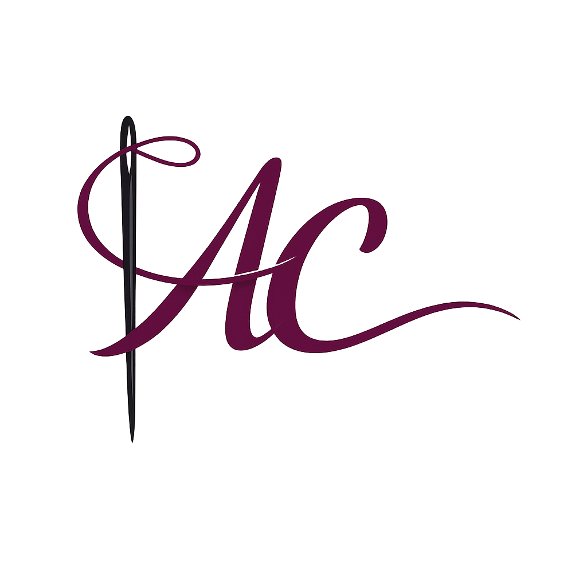

# AntiCape Corp
Este es el proyecto para la mejor empresa diseñadora de trajes para superheroes.

### Archivos importantes
- [Memoria](Documentacion/Proyecto/Memoria_PI.pdf)
- BBDD
    - [Modelo Relacional](Data-Base/esquemas/modelos/Modelo_R.pdf)
    - [Modelo E/R](Data-Base/esquemas/modelos/modelo_E-R.pdf)
- Programación
    - [Proyecto de Java](Programacion/java)
    - [Diagrama UML](Documentacion/Tecnica/Diagramas/uml.pdf)
- Brand
    - [Logo](Corp/Logos/logo.png)
    - [Etiqueta](Corp/Elementos-graficos/etiqueta.png)

*Archivos PDF o PNG van acompañados de sus "proyectos" (los archivos editables desde donde se exportaron, e.g. ".docx", ".drawio"...) en la misma carpeta.*

Los archivos "creacion.txt" están ahí para que la estructura de las carpetas se pueda subir a Github.